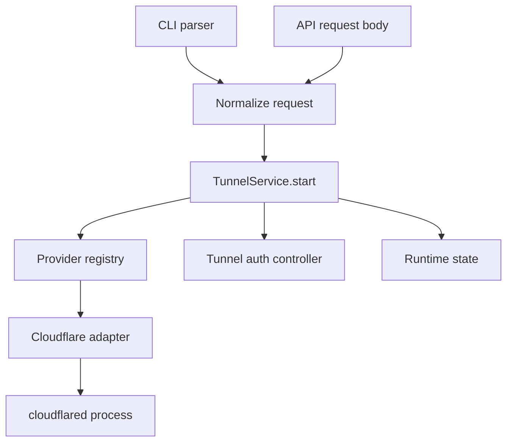

# OpenChamber Tunnel Restructure Plan (API-Centered, Provider-Ready)

## Status

- Owner intent: align tunnel terminology with industry/cloud vendor terminology, keep CLI backward compatibility, and make implementation maintainable for additional providers.
- Scope: web runtime server + CLI contract + shared tunnel domain model.
- Non-goal for this phase: full UI rewrite. UI can migrate progressively via compatibility mapping.

---

## 1) Why we are changing this

Current implementation has two practical issues:

1. Terminology drift:
   - Existing internal mode labels (`quick` / `named`) are not ideal for long-term clarity.
   - In Cloudflare docs, the stronger terms are `quick tunnel`, `remotely-managed tunnel`, `locally-managed tunnel`.

2. Multiple startup paths:
   - CLI startup (`--try-cf-tunnel`) and API startup (`/api/openchamber/tunnel/start`) are separate flows.
   - That creates duplication risk and makes future provider support harder.

This plan introduces one canonical tunnel domain model and one service flow shared by UI and CLI.

---

## 2) Cloudflare terminology confirmation (source-aligned)

From Cloudflare docs:

- `Quick tunnels`: ephemeral `trycloudflare.com` URLs.
- `Remotely-managed tunnel`: tunnel configuration managed in Cloudflare dashboard/API.
- `Locally-managed tunnel`: tunnel created/managed via local `cloudflared` config/credentials.
- `cloudflared tunnel --config <PATH> run ...`:
  - documented as locally-managed usage,
  - default config path is `~/.cloudflared/config.yml` when omitted.

Implication for OpenChamber naming:

- Do not use `named` as the canonical cross-provider mode term.
- Use a model that can represent management style explicitly.

---

## 3) Canonical domain model

Adopt the following normalized request model for tunnel operations:

```ts
type TunnelProvider = 'cloudflare' | string;

type TunnelMode =
  | 'quick'
  | 'managed-remote'
  | 'managed-local';

interface TunnelStartRequest {
  provider: TunnelProvider;            // default: 'cloudflare'
  mode: TunnelMode;

  // provider-agnostic optional knobs
  displayName?: string;

  // provider-specific options (Cloudflare v1)
  configPath?: string | null;          // used by managed-local
  token?: string | null;               // used by managed-remote
  hostname?: string | null;            // may be required by UX/policy
  tunnelNameOrId?: string | null;      // optional pass-through if needed later

  // server context options
  localOriginUrl?: string;             // usually computed server-side
}
```

Design notes:

- `mode` is intentionally explicit (`managed-remote`, `managed-local`) for logs and maintainability.
- `provider` is first-class for future multi-provider support.
- Provider-specific fields are allowed but validated via provider capability rules.

---

## 4) API contract strategy

Keep existing endpoints, evolve payloads.

### Existing endpoints to preserve

- `GET /api/openchamber/tunnel/check`
- `GET /api/openchamber/tunnel/status`
- `POST /api/openchamber/tunnel/start`
- `POST /api/openchamber/tunnel/stop`
- `PUT /api/openchamber/tunnel/named-token` (legacy naming can remain until later cleanup)

### Start endpoint evolution

`POST /api/openchamber/tunnel/start` accepts both:

1. New shape:

```json
{
  "provider": "cloudflare",
  "mode": "managed-local",
  "configPath": "/path/to/config.yml"
}
```

2. Legacy shape:

```json
{
  "mode": "quick"
}
```

Compatibility mapping:

- `mode: quick` (legacy) -> `{ provider: "cloudflare", mode: "quick" }`
- `mode: named` (legacy) -> `{ provider: "cloudflare", mode: "managed-remote" }`

Response shape can remain stable in v1, with optional additive fields:

- `provider`, `mode`, `activeTunnelMode` should reflect normalized mode values.

---

## 5) CLI contract (new + backward compatibility)

## Canonical CLI options

- `--tunnel-provider <provider>` (default `cloudflare`)
- `--tunnel-mode <quick|managed-remote|managed-local>`
- `--tunnel-config [path]` (optional path; when omitted, provider default behavior)
- `--tunnel-token <token>`
- `--tunnel-hostname <hostname>`

### Backward compatible aliases

- `--try-cf-tunnel` (existing):
  - maps to `--tunnel-provider cloudflare --tunnel-mode quick`
  - prints deprecation guidance.

### Deprecation UX

- Warn once per process when legacy options are used.
- Warning text pattern:
  - `--try-cf-tunnel is deprecated; use --tunnel-provider cloudflare --tunnel-mode quick`
- Keep old flags functional for at least two minor releases.

### Deprecation timeline decision

- Legacy CLI option `--try-cf-tunnel` remains supported for two minor releases from the first release that includes canonical flags.
- Legacy API mode value `named` remains accepted for two minor releases.
- After that window, emit hard validation errors unless a compatibility mode is explicitly enabled.

### Precedence rules

- New canonical flags always win over legacy aliases.
- If both old and new are set, continue using normalized new values and emit one warning.

---

## 6) Provider adapter architecture

Add a provider abstraction layer under server tunnel libraries:

```text
packages/web/server/lib/tunnels/
  index.js                    // service entrypoint
  types.js                    // runtime validation + helpers
  registry.js                 // provider registry
  providers/
    cloudflare.js             // cloudflare adapter
```

Cloudflare adapter responsibilities:

- `checkAvailability()`
- `start(request)` where request mode is one of:
  - `quick`
  - `managed-remote`
  - `managed-local`
- `stop(controller)`
- `resolvePublicUrl(...)` for session/bootstrap and status.

Each provider advertises capabilities:

```ts
interface TunnelProviderCapabilities {
  provider: string;
  modes: TunnelMode[];
  supportsConfigPath: boolean;
  supportsToken: boolean;
  supportsHostname: boolean;
}
```

This supports future providers without API redesign.

---

## 7) Cloudflare behavior mapping

### Mode: `quick`

- Equivalent to current quick tunnel flow.
- Starts ephemeral trycloudflare URL.

### Mode: `managed-remote`

- Equivalent to current token-based named flow.
- Uses remote-managed semantics (Cloudflare dashboard/API-managed tunnel config).
- Token-based run path remains supported.

### Mode: `managed-local`

- New feature target for issue #120.
- Starts cloudflared with local config behavior:
  - explicit path: `cloudflared tunnel --config <PATH> run ...`
  - omitted path: `cloudflared tunnel run ...` (cloudflared default config path behavior)
- Config parsing can extract hostname info for OpenChamber connect URL/auth gating metadata.

Note: Cloudflare docs describe `--config` as locally-managed usage; this aligns with requested behavior.

---

## 8) Unified service flow (UI + CLI)

Both UI and CLI must use the same service implementation.



Implementation rule:

- Avoid duplicated start logic between startup path and API route.
- Refactor shared flow into service function, then call from:
  - startup bootstrap (CLI-driven server start),
  - `/api/openchamber/tunnel/start`.

---

## 9) Data model and state changes

Current runtime fields should evolve to provider-aware state:

- active provider
- active normalized mode
- controller/process handle
- public URL
- provider metadata (e.g., config path used, tunnel id/name if available)

Status endpoint should include additive fields:

```json
{
  "active": true,
  "provider": "cloudflare",
  "mode": "managed-local",
  "url": "https://example.com",
  "localPort": 3000
}
```

Legacy consumers may continue reading old fields until migrated.

---

## 10) Error handling and validation policy

Validation order:

1. Generic request validation (`provider`, `mode`)
2. Provider capability validation
3. Mode-required field validation
4. Runtime checks (`cloudflared` installed, file exists, etc.)

Error classes (recommended internal tags):

- `validation_error`
- `provider_unsupported`
- `mode_unsupported`
- `missing_dependency`
- `startup_failed`

User-facing errors should remain actionable:

- "cloudflared is not installed. Install with: brew install cloudflared"
- "managed-local mode requires readable config path"

---

## 11) CLI examples (target state)

```bash
# Quick ephemeral tunnel
openchamber --tunnel-provider cloudflare --tunnel-mode quick

# Managed local tunnel using cloudflared default config path
openchamber --tunnel-provider cloudflare --tunnel-mode managed-local --tunnel-config

# Managed local tunnel using explicit config path
openchamber --tunnel-provider cloudflare --tunnel-mode managed-local --tunnel-config ~/.cloudflared/config.yml

# Managed remote tunnel using token
openchamber --tunnel-provider cloudflare --tunnel-mode managed-remote --tunnel-token <TOKEN>

# Backward compatible legacy flag (still works, warns)
openchamber --try-cf-tunnel
```

Note on optional value flag parsing:

- `--tunnel-config` with no value means "use provider default config path behavior".

---

## 12) Migration matrix

| Old input | Normalized request |
| --- | --- |
| `--try-cf-tunnel` | `provider=cloudflare, mode=quick` |
| API `mode=quick` | `provider=cloudflare, mode=quick` |
| API `mode=named` | `provider=cloudflare, mode=managed-remote` |

No hard break for existing users.

---

## 13) Documentation updates required

Update docs to use canonical terms while keeping compatibility notes:

- Root `README.md`
- `packages/web/README.md`
- CLI `--help` output in `packages/web/bin/cli.js`

Doc language guideline:

- use `quick`, `managed-remote`, `managed-local` in technical sections,
- explain legacy alias mapping once.

---

## 14) Implementation phases

### Phase A - Foundations

1. Add normalized request model + parser mapping.
2. Add provider registry + cloudflare adapter scaffold.
3. Refactor existing tunnel start/stop to shared `TunnelService`.

### Phase B - CLI/API convergence

1. Wire CLI startup through normalized request into shared service.
2. Wire `/api/openchamber/tunnel/start` through same shared service.
3. Add legacy compatibility translation and warnings.

### Phase C - managed-local support

1. Implement `managed-local` for cloudflare with optional config path.
2. Add config validation and hostname extraction behavior.
3. Ensure status/auth lifecycle remains consistent.

### Phase D - hardening and cleanup

1. Add tests for mapping, precedence, and mode validation.
2. Update docs/help examples.
3. Evaluate deprecation timeline for legacy options.

---

## 15) Test plan (minimum)

### Parser tests

- old flag maps correctly.
- new flags parse correctly.
- optional-value `--tunnel-config` works with and without path.
- precedence old vs new is deterministic.

### Service tests

- provider/mode validation and capability checks.
- cloudflare quick start path.
- cloudflare managed-remote start path.
- cloudflare managed-local start path with explicit + default config behavior.

### API tests

- `/start` accepts legacy and new payloads.
- `/status` reflects normalized mode/provider.
- `/stop` clears state and revokes access artifacts.

### Baseline repo checks

- `bun run type-check`
- `bun run lint`
- `bun run build`

---

## 16) Future provider readiness

When adding another provider:

1. Implement adapter in `providers/<name>.js`.
2. Register capabilities.
3. Add provider-specific validation.
4. No API redesign required.
5. CLI already supports provider selection via `--tunnel-provider`.

This avoids hardcoding Cloudflare assumptions into API semantics.

---

## 17) Key decisions locked by this plan

1. Canonical modes use `managed-remote` and `managed-local` (not `named`).
2. API-centered architecture with shared service for UI and CLI.
3. Backward compatibility kept via translation + warnings.
4. Provider field is first-class to support future tunnel providers.

---

## 18) Open questions (for implementation kickoff)

1. Should we add shorthand aliases (`--quick-tunnel`) immediately or after core migration?
2. Should managed-local require hostname extraction from config, or allow startup without connect-link generation when hostname is missing?
3. Timeline for turning legacy deprecation warning into hard error (if ever).

---

## 19) Agent handoff checklist

Use this checklist for implementation agents:

1. Introduce normalized tunnel request model and compatibility translator.
2. Refactor tunnel start/stop logic into shared service.
3. Implement cloudflare `managed-local` mode (`--tunnel-config [path]`).
4. Add CLI canonical flags and legacy mapping warnings.
5. Route both startup and API start through shared service.
6. Update help/docs/readmes.
7. Run type-check, lint, build.
8. Provide migration notes in PR summary.
